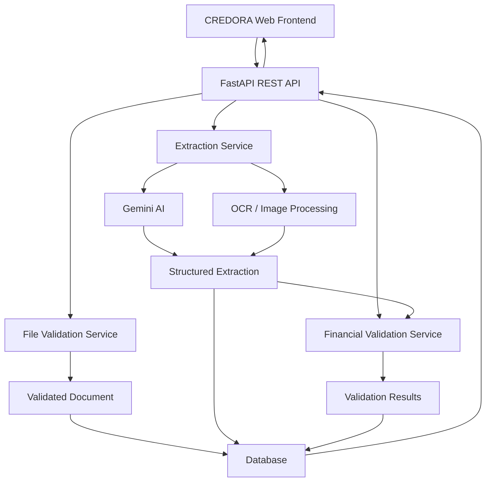

# CREDORA — Financial Document Intelligence

<p align="center">
  <strong>Structured intelligence for financial documents.</strong>
</p>

<p align="center">
  An AI-powered document intelligence system for extracting, structuring, and validating financial information from invoices and financial statements.
</p>

<p align="center">
  
  
  
  
  
</p>

---

## Overview

**CREDORA** is an AI-powered financial document intelligence application designed to transform unstructured financial documents into structured, traceable, and validated data.

The system accepts **PDF, JPG, JPEG, and PNG** documents, performs file validation, extracts meaningful visible information using AI/OCR, structures the extracted information into JSON, performs deterministic financial consistency checks, persists the results, and presents them through a web-based dashboard.

The system is designed around one core principle:

> **Extract what is present, never invent what is missing, and validate what can be mathematically verified.**

---
## Live Demo & Resources

| Resource | Link |
|---|---|
| Live Application | https://credora-backend-v792.onrender.com |
| Backend API | https://credora-backend-v792.onrender.com/api/v1/health |
| Swagger / OpenAPI | https://credora-backend-v792.onrender.com/docs |
| GitHub Repository | https://github.com/CatherineJoe4/document-intelligence |

## Key Capabilities

| Capability | Description |
|---|---|
| Document Processing | Process PDF, JPG, JPEG, and PNG files |
| Document Types | Invoice, Balance Sheet, Profit & Loss, Cash Flow Statement |
| File Validation | Type, size, integrity, readability, and page-count checks |
| AI Extraction | Gemini-based structured document understanding |
| OCR Support | Processing support for scanned and image-based documents |
| Table Extraction | Structured extraction of financial tables and invoice line items |
| Evidence | Source text and page information where available |
| Financial Validation | Deterministic reconciliation checks |
| Persistence | Stores processed results in a database |
| Dashboard | View processed documents and detailed results |
| API | REST API built with FastAPI |
| Documentation | Swagger/OpenAPI |
| Testing | Automated Pytest test suite |

---

# Supported Documents

## 1. Invoice

CREDORA extracts available invoice information including:

- Seller / vendor
- Buyer / customer
- Invoice number
- Invoice date
- Currency
- Taxable amount
- Tax amount
- Total amount
- Amount paid
- Change
- Discounts
- Line items
- Quantity
- Unit price
- Line total
- Other meaningful visible information

### Invoice Validation

The system checks applicable relationships such as:

```text
Quantity × Unit Price ≈ Line Total

Sum of Line Totals ≈ Subtotal / Total

Taxable Amount + Tax ≈ Total

Cash Paid − Total ≈ Change
```

The system also handles cases where tax or GST is included in the reported total.

---

## 2. Balance Sheet

The system extracts available balance-sheet line items and comparative periods.

### Balance Sheet Validation

```text
Total Assets ≈ Total Capital & Liabilities
```

Component-level reconciliation is also performed when sufficient information is available.

Comparative periods are validated independently.

---

## 3. Profit & Loss

The system extracts available:

- Income
- Expenditure
- Interest
- Operating expenses
- Provisions and contingencies
- Profit figures
- Minority interest
- Appropriations
- Comparative periods

### Profit & Loss Validation

Applicable checks include:

```text
Interest Earned + Other Income ≈ Total Income

Interest Expended
+ Operating Expenses
+ Provisions & Contingencies
≈ Total Expenditure

Total Income − Total Expenditure
≈ Consolidated Net Profit before Minority Interest

Profit before Minority Interest − Minority Interest
≈ Consolidated Net Profit attributable to Group
```

Comparative periods are validated independently.

---

## 4. Cash Flow Statement

The system extracts cash-flow components and comparative periods.

### Cash Flow Validation

Applicable checks include:

```text
Operating Cash Flow
+ Investing Cash Flow
+ Financing Cash Flow
+ FX / Applicable Adjustment
≈ Net Increase / Decrease in Cash
```

and:

```text
Opening Cash
+ Reported Net Increase / Decrease
≈ Closing Cash
```

Parentheses and brackets are interpreted as negative financial values.

Comparative periods are validated independently.

---

# Validation Philosophy

CREDORA separates **AI extraction** from **financial calculation**.

AI is responsible for understanding the document and extracting structured information.

The backend is responsible for performing deterministic financial calculations.

This prevents the AI model from being the final authority on whether a financial statement reconciles.

### Validation Statuses

| Status | Meaning |
|---|---|
| `PASS` | The calculated value reconciles with the reported value within the applicable tolerance |
| `FAIL` | Required values are available, but the calculation does not reconcile |
| `NOT_APPLICABLE` | Required information is missing or cannot be reliably established |

A missing value is represented as:

```json
null
```

The system does not invent unsupported financial values.

---

# Architecture



---

# End-to-End Workflow

```text
Document Upload
       |
       v
File Validation
       |
       v
AI / OCR Extraction
       |
       v
Structured Data
       |
       v
Financial Validation
       |
       v
Database Persistence
       |
       v
REST API
       |
       v
CREDORA Dashboard
```

---

# Project Structure

```text
document-intelligence/
│
├── README.md
├── .env.example
├── .gitignore
├── pytest.ini
│
├── backend/
│   ├── requirements.txt
│   │
│   ├── app/
│   │   ├── __init__.py
│   │   ├── main.py
│   │   │
│   │   ├── api/
│   │   │   ├── __init__.py
│   │   │   └── routes/
│   │   │       ├── __init__.py
│   │   │       ├── documents.py
│   │   │       └── health.py
│   │   │
│   │   ├── core/
│   │   │   ├── __init__.py
│   │   │   ├── config.py
│   │   │   ├── database.py
│   │   │   └── logging.py
│   │   │
│   │   ├── models/
│   │   │   ├── __init__.py
│   │   │   └── document.py
│   │   │
│   │   ├── repositories/
│   │   │   ├── __init__.py
│   │   │   └── document_repository.py
│   │   │
│   │   ├── schemas/
│   │   │   ├── __init__.py
│   │   │   └── document.py
│   │   │
│   │   └── services/
│   │       ├── __init__.py
│   │       ├── document_service.py
│   │       ├── document_validation_service.py
│   │       ├── extraction_service.py
│   │       └── financial_validation_service.py
│   │
│   └── tests/
│       ├── conftest.py
│       ├── test_api.py
│       ├── test_balance_sheet_validation.py
│       ├── test_cash_flow_validation.py
│       ├── test_extraction.py
│       ├── test_financial_validation.py
│       ├── test_invoice_validation.py
│       └── test_validation.py
│
├──frontend/
│    ├── templates/
│    │   └── index.html
│    │
│    └── static/
│        ├── css/
│        │   └── style.css
│        └── js/
│           └── app.js
├── docs/
│   ├── architecture.png
│   └── solution_presentation.pdf
│
└── sample_outputs/
    └── sample_cash_flow_statement.json
```

---

# Technology Stack

## Backend

| Technology | Purpose |
|---|---|
| Python 3.12 | Core development |
| FastAPI | REST API |
| Pydantic | Data validation and schemas |
| SQLAlchemy | Database ORM |
| SQLite | Local persistence |
| PyMuPDF | PDF processing |
| Pillow | Image processing |
| Pytesseract | OCR support |
| Google Gemini API | AI-assisted extraction |

## Frontend

- HTML
- CSS
- JavaScript

## Testing

- Pytest
- FastAPI TestClient

---

# API Reference

## Health Check

```http
GET /api/v1/health
```

Returns the current API health status.

---

## Process Document

```http
POST /api/v1/documents/process
```

### Request

Multipart form-data:

```text
file
document_type
```

### Supported Document Types

```text
invoice
balance_sheet
profit_and_loss
cash_flow_statement
```

---

## Get Latest Document Result

```http
GET /api/v1/documents/{document_name}
```

Returns the latest processed result for the specified document name.

---

## List Processed Documents

```http
GET /api/v1/documents
```

Returns processed documents including:

- Document name
- Document type
- Processing status
- Timestamp

---

## Swagger / OpenAPI

When running locally:

```text
http://127.0.0.1:8000/docs
```

Swagger provides an interactive interface for testing the API endpoints.

---

# Data Persistence

Processed results are stored using SQLAlchemy.

Each result can contain:

- Document name
- Document type
- Processing status
- File validation result
- Extracted structured data
- Financial validation results
- Processing metadata
- Created timestamp
- Updated timestamp

When the same document name is requested, the latest processed result is returned.

---

# File Validation

Before extraction, uploaded documents are validated for:

- Supported file type
- Empty files
- File integrity
- File size
- PDF readability
- Maximum page count
- Image readability

Unsupported or invalid files are rejected before AI extraction.

---

# Extraction Approach

The extraction service uses AI-assisted document understanding to convert document content into structured JSON.

The extraction process is designed to:

1. Inspect the document structure.
2. Identify meaningful visible information.
3. Preserve table structure where possible.
4. Extract invoice line items.
5. Preserve source text and page information when available.
6. Represent missing or unreadable values as `null`.
7. Avoid inventing unsupported values.
8. Keep extraction separate from financial calculations.

---

# Design Principles

## Extraction Completeness

The system aims to extract all meaningful visible information instead of relying only on a small predefined set of fields.

## No Hallucination

If a value cannot be reliably read or identified, the system returns `null` instead of generating an unsupported value.

## Separation of Responsibilities

AI handles document understanding and structured extraction.

Deterministic backend logic handles financial reconciliation.

## Evidence Preservation

Where available, extracted values retain source text and page information to improve traceability.

---

# Testing

Run the complete automated test suite from the project root:

```powershell
pytest
```

### Current Result

```text
12 passed
```

### Test Coverage

The test suite covers:

- API functionality
- File validation
- Invoice validation
- Balance Sheet validation
- Profit & Loss validation
- Cash Flow validation
- Extraction behavior
- Financial validation behavior
- Successful reconciliation
- Intentional validation failures
- Missing values
- Invalid files
- Unsupported files

---

# Demonstrated Test Scenarios

The application has been tested with:

| Scenario | Coverage |
|---|---|
| Invoice documents | Yes |
| Balance Sheets | Yes |
| Profit & Loss statements | Yes |
| Cash Flow Statements | Yes |
| JPG invoice images | Yes |
| Comparative financial periods | Yes |
| Negative values using parentheses | Yes |
| Successful validation | Yes |
| Intentional validation failure | Yes |
| Missing / unavailable values | Yes |
| Invalid files | Yes |
| Unsupported files | Yes |
| Health API | Yes |
| Processed document listing | Yes |
| Latest result retrieval | Yes |
| Frontend result display | Yes |

---

# Error Handling

The application performs controlled validation and returns appropriate API responses for invalid inputs.

Examples include:

- Unsupported file types
- Empty files
- Corrupt files
- Files exceeding the configured size limit
- PDFs exceeding the configured page limit
- Documents that cannot be processed

Internal stack traces and sensitive implementation details are not exposed to end users.

---

# Configuration

Create a `.env` file in the project root.

Example:

```env
GEMINI_API_KEY=your_gemini_api_key_here
GEMINI_MODEL=gemini-3.6-flash
DATABASE_URL=sqlite:///./document_intelligence.db
```

The actual `.env` file must never be committed to source control.

---

# Local Development

## 1. Clone the Repository

```powershell
git clone <repository-url>
cd document-intelligence
```

## 2. Create a Virtual Environment

```powershell
python -m venv .venv
```

## 3. Activate the Environment

```powershell
.venv\Scripts\Activate.ps1
```

## 4. Install Dependencies

```powershell
pip install -r backend/requirements.txt
```

## 5. Configure Environment Variables

Create `.env` in the project root and add the required configuration.

## 6. Start the Backend

```powershell
$env:PYTHONPATH="backend"
uvicorn app.main:app --reload
```

The API will be available at:

```text
http://127.0.0.1:8000
```

Swagger:

```text
http://127.0.0.1:8000/docs
```

---

# Security

Secrets are managed through environment variables.

The repository excludes sensitive and generated files such as:

```text
.env
.env.*
.venv/
*.db
*.sqlite
uploads/
outputs/
temp/
```

A safe `.env.example` file is included as a configuration template.

API credentials should never be committed to source control.

---

# Known Limitations

- AI extraction quality can vary depending on document quality, layout, rotation, and scan quality.
- Very complex tables may require additional layout-aware processing.
- Poor-quality scans may result in missing or unreadable values.
- Financial validation depends on the extracted table structure and labels.
- The current application does not implement user authentication or document-level access control.
- Local development uses SQLite.
- AI API availability and quota can affect processing.

---

# Production Improvements

Potential production enhancements include:

### Security

- User authentication
- Authorization
- User/document ownership
- API authentication
- Rate limiting
- Stronger access controls

### Infrastructure

- Scalable PostgreSQL configuration and database optimization
- Object storage
- Background processing
- Queue-based architecture
- Automated deployment pipelines

### AI and Extraction

- Improved OCR preprocessing
- Layout-aware table extraction
- More advanced document understanding
- Better handling of complex and low-quality scans

### Reliability

- Monitoring and observability
- Document version management
- Expanded integration testing
- Load testing
- More granular audit logging

---

# AI / Tool Usage Declaration

AI-assisted development tools were used during development for:

- Code generation and refinement
- Debugging
- Financial validation logic review
- Extraction prompt design
- Test-case generation
- Documentation assistance

The application itself uses the configured **Google Gemini API** for AI-assisted document extraction.

Financial validation is implemented separately using deterministic Python logic.

---
### Project Artifacts

- [Architecture Diagram](docs/architecture.png)
- [Solution Presentation](docs/solution_presentation.pdf)
- [Sample JSON Output](sample_outputs/sample_cash_flow_statement.json)

# Project Status

CREDORA currently provides an end-to-end document intelligence workflow covering:

```text
Upload
  |
  v
Validation
  |
  v
AI / OCR Extraction
  |
  v
Structured JSON
  |
  v
Financial Validation
  |
  v
Database Persistence
  |
  v
REST API
  |
  v
Web Dashboard
```

The project demonstrates a complete AI Engineer technical case-study implementation and provides a foundation for extending the system into a production-grade financial document intelligence platform.

---

## Author

**Catherine Shiny E**

M.Sc. Data Science
